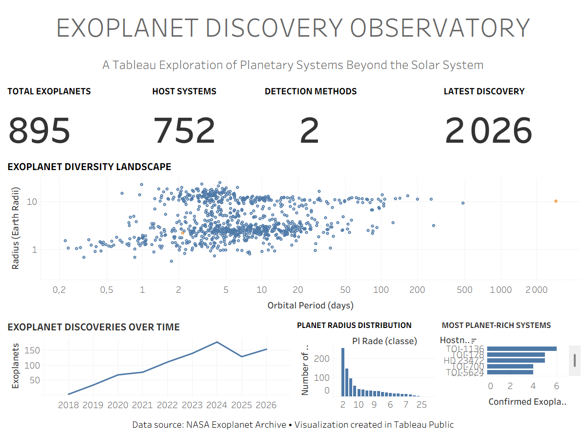

# 🌌 Observatoire de Découverte des Exoplanètes

### Une exploration Tableau des systèmes planétaires au-delà du Système solaire

---

## Aperçu du Tableau de Bord

🔭 **Explorer le tableau de bord interactif sur Tableau Public :**

https://public.tableau.com/app/profile/sabrina.palis/viz/Exoplanet_Discovery_Observatory/Tableaudebord1?publish=yes

---

## Présentation

**Observatoire de Découverte des Exoplanètes** est un tableau de bord interactif développé avec Tableau permettant d'explorer des exoplanètes confirmées découvertes au-delà de notre Système solaire.

Construit à partir des données de la NASA Exoplanet Archive, ce projet propose une vue d'ensemble accessible des systèmes planétaires, des tendances de découverte, des étoiles hôtes et des caractéristiques des planètes observées.

Cette réalisation a été conçue comme un artefact de portfolio mettant en évidence des compétences pratiques en :

- conception de tableaux de bord
- analyse exploratoire de données
- visualisation scientifique
- narration par la donnée (*data storytelling*)
- publication de visualisations interactives avec Tableau Public

---

## Questions Explorées

Ce tableau de bord cherche notamment à répondre aux questions suivantes :

- Combien d'exoplanètes confirmées sont représentées dans le jeu de données ?
- Combien de systèmes stellaires hébergent des exoplanètes connues ?
- Comment le rythme des découvertes a-t-il évolué au fil du temps ?
- Quelles tailles de planètes sont les plus fréquemment observées ?
- Quels systèmes stellaires hébergent le plus grand nombre d'exoplanètes ?
- Quelle relation existe entre la période orbitale et le rayon des planètes ?

---

## Composants du Tableau de Bord

### Vue d'ensemble des indicateurs clés

Une série d'indicateurs synthétiques présentant :

- Nombre total d'exoplanètes
- Nombre de systèmes hôtes
- Nombre de méthodes de détection
- Dernière année de découverte représentée

### Paysage de Diversité des Exoplanètes

Nuage de points explorant la relation entre :

- la période orbitale
- le rayon des planètes

Cette visualisation met en évidence la diversité des systèmes planétaires et révèle des regroupements d'objets partageant des caractéristiques similaires.

### Chronologie des Découvertes

Évolution du nombre d'exoplanètes découvertes au fil du temps, illustrant l'accélération remarquable des découvertes au cours de la dernière décennie.

### Distribution des Rayons Planétaires

Répartition des tailles des planètes observées, permettant d'identifier les gammes de rayons les plus représentées dans l'échantillon étudié.

### Systèmes les Plus Riches en Planètes

Comparaison des systèmes stellaires hébergeant le plus grand nombre d'exoplanètes confirmées.

---

## Source des Données

**NASA Exoplanet Archive**

https://exoplanetarchive.ipac.caltech.edu

La NASA Exoplanet Archive est une base de données scientifique publique regroupant les exoplanètes confirmées ainsi que les informations associées à leurs systèmes stellaires.

---

## Outils Utilisés

- Tableau Public
- Microsoft Excel
- NASA Exoplanet Archive

---

## Contexte du Portfolio

Ce tableau de bord s'inscrit dans un ensemble plus large de projets consacrés aux données spatiales, à l'exploration scientifique et à la recherche computationnelle, en complément de travaux portant sur :

- les systèmes d'IA exploratoires
- les workflows de découverte scientifique
- la détection d'anomalies
- la recherche computationnelle
- l'exploration de données inspirée de l'astronomie

Cette réalisation constitue une démonstration concrète de compétences en visualisation de données, communication analytique et conception de tableaux de bord interactifs.

---

## Auteur

**Sabrina Palis**  
IA Appliquée • Recherche Computationnelle • Enseignement Technique

*MSc Artificial Intelligence (First Class Honours)*

GitHub : https://github.com/MinervaRose

Tableau Public : https://public.tableau.com/app/profile/sabrina.palis
